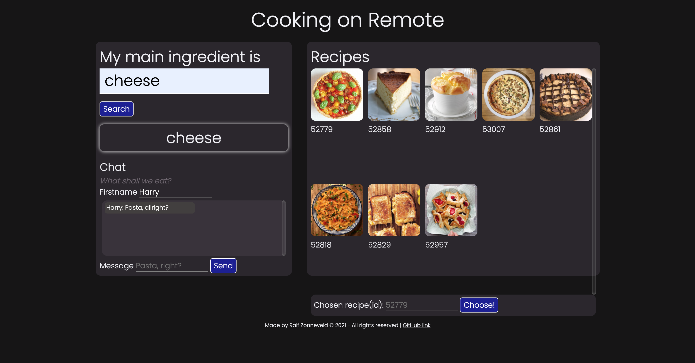
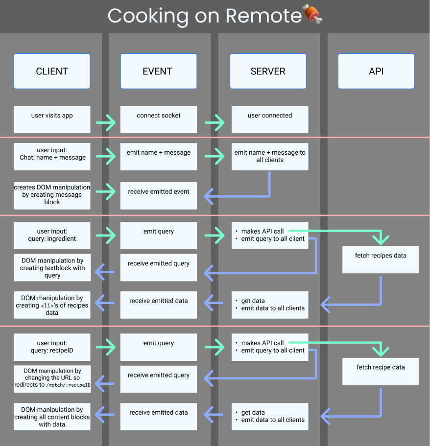

##### Real Time Web @cmda-minor-web 2020 - 2021

  [](https://rtw-2021.herokuapp.com/) [](shields.io)
# Cooking on Remote :fork_and_knife: :meat_on_bone:
_Real-Time Web, a course of the minor Web Design & Development. It is a minor of the third year from the study [CMD](https://www.cmd-amsterdam.nl/)._

[Link to live version :rocket:](https://rtw-2021.herokuapp.com/)

### Table of Contents
<table>
    <tr>
        <td align="center"><a href="#rocket-purpose">🚀 Purpose<a></td>
        <td align="center"><a href="#heart_eyes-concept">😍 Concept<a></td>
        <td align="center"><a href="#nerd_face-techstuff">🤓 TechStuff<a></td>
        <td align="center"><a href="#lipstick-codestyle">💄 CodeStyle<a></td>
        <td align="center"><a href="#1234-data">🔢 Data<a></td>
        <td align="center"><a href="#gear-installation">⚙️ Installation<a></td>
        <td align="center"><a href="#file_folder-sources">📁 Sources<a></td>
        <td align="center"><a href="#cop-license">👮 License<a></td>
    </tr> 
</table>

## :rocket: Purpose
During this course you will learn how to build a real-time application. You will learn techniques to setup an open connection between the client and the server. This will enable you to send data in real-time both ways, at the same time.

The course Real-Time Web is about learning how to build a real-time application. Real-Time Web is part of the half year minor programme about Web Design and Development in Amsterdam. Bachelor Communication and Multimedia Design, Amsterdam University of Applied Science.

## :heart_eyes: Concept
[_3 Concepts_](https://github.com/ralfz123/real-time-web-2021/wiki)

>_This is the solution for cooking together in times of Corona :fork_and_knife:._

This application is an app where you can cook with each other on distance (each person from his/her own house). You start the application where you can both search on recipes by entering some food ingredients that you have in your house. When you both are agree with one recipe, you click on that recipe and you can start cooking. You both set a timer about how long you think it will take to cook the recipe. Also you follow the instructions of the recipe and you can check them by the checkboxes. The person who finishes the dish first is the winner :trophy: .


### Sketch

<figure>
     
    <figcaption>First sketch</figcaption>
</figure>


<figure>
     
    <figcaption>Screenshot live app</figcaption>
</figure>

### Features
<!-- **Login**  
- Authenticated login with username and password
- Create rooms of 2 persons

**App**   -->
- You can search through recipes by entering a ingredient
- You can chat with each other to talk about which recipe you pick
- You can see the details of the recipe, when it's chosen
- You can set a timer and follow the instructions of the recipe both on the same time (real-time :wink: )
- You can get an embedded YouTube video of how to make the recipe

### Realtime events 
Chat with each other
> Messages are emitted to all clients

Recipe search on ingredient query
> Query and data reponse are emitted to all clients

Go to match page when recipe is chosen
> All clients will be redirected to the match page (with the recipe data included) when a recipe is chosen by one person. 

Extended timer indication (from you and the other one)
> The timer-time will be emitted to all clients, so that everyone knows each other's timer-time.

Winner result
> The Result of the winner will b

### Spike
#### Timer and Instructions challenge 
I was thinking about whether to use the timer for when the recipe is ready or the real-time instruction checklist. So I was testing it myself and I discussed it with other students, and I came to the conclusion that I'm going to use both. In this app I am only going to build the timer, but the backlog has instruction checklist ready.

## :nerd_face: TechStuff
This app is built, using:
- [socket.io](http://socket.io/)
- [npm](https://www.npmjs.com/)
- [Node.js server](https://nodejs.org/)
- [Express router](https://expressjs.com/)
- [EJS Templating engine](https://ejs.co/)
- [Heroku deployment](https://www.heroku.com/nodejs)

### Packages

[ejs](https://www.npmjs.com/package/ejs)  

>Embedded JavaScript templates

[express](https://www.npmjs.com/package/express)  

>Fast, unopinionated, minimalist web framework for node.

[nodemon](https://www.npmjs.com/package/nodemon)

>nodemon is a tool that helps develop node.js based applications by automatically restarting the node application when file changes in the directory are detected.

[socket.io](https://www.npmjs.com/package/socket.io)

>Socket io enables real-time bidirectional event-based communication

## :lipstick: CodeStyle
I prefer to work with these dev-rules for myself:
- Use of semicolon at the end of the line
- Indent spaces: 2
- Code comments
    - Param explanation of functions
    - Inline code comments after variable declaration
- Naming of variables and functions has to be descriptive
- ES6 modules

# :1234: Data
## Datamodel / management
lorem lorem lorem

## API Data
### API is
- [themealDB](https://www.themealdb.com/api.php)

### :key: KEY
You can get the data by entering a query after the url.
Developer test `API-KEY` = `1`.  

[Here](https://www.themealdb.com/api.php) is a list of how you handle the URL of the API.

Search meal by name - `www.themealdb.com/api/json/v1/1/search.php?s=Arrabiata`  
List all meals by first letter - `www.themealdb.com/api/json/v1/1/search.php?f=a`  
Lookup full meal details by id - `www.themealdb.com/api/json/v1/1/lookup.php?i=52772`  

### Data variables
The data variables I used, are:
- `idMeal`
- `strMeal`
- `strCategory`
- `strIngredient`
- `strInstructions`
- `strMealThumb`
- `strYoutube`

### Dataset structure
#### RAW
```js
{
    idMeal: "52779",
    strMeal: "Cream Cheese Tart",
    strDrinkAlternate: null,
    strCategory: "Starter",
    strArea: "Unknown",
    strInstructions: "Crust: make a dough from 250g flour (I like mixing different flours like plain and wholegrain spelt flour), 125g butter, 1 egg and a pinch of salt, press it into a tart form and place it in the fridge. Filling: stir 300g cream cheese and 100ml milk until smooth, add in 3 eggs, 100g grated parmesan cheese and season with salt, pepper and nutmeg. Take the crust out of the fridge and prick the bottom with a fork. Pour in the filling and bake at 175 degrees C for about 25 minutes. Cover the tart with some aluminium foil after half the time. In the mean time, slice about 350g mini tomatoes. In a small pan heat 3tbsp olive oil, 3tbsp white vinegar, 1 tbsp honey, salt and pepper and combine well. Pour over the tomato slices and mix well. With a spoon, place the tomato slices on the tart, avoiding too much liquid on it. Decorate with basil leaves and enjoy",
    strMealThumb: "https://www.themealdb.com/images/media/meals/wurrux1468416624.jpg",
    strTags: "Tart,Savory",
    strYoutube: "https://www.youtube.com/watch?v=UhQPwO4uymo",
    strIngredient1: "Flour",
    strIngredient2: "Butter",
    strIngredient3: "Egg",
    strIngredient4: "Salt",
    strMeasure1: "250g",
    strMeasure2: "125g",
    strMeasure3: "1",
    strMeasure4: "Pinch",
    strSource: "https://www.instagram.com/p/BHyuMZ1hZX0",
    strImageSource: null,
    strCreativeCommonsConfirmed: null,
    dateModified: null
},
```

#### CLEAN
With [map](https://github.com/ralfz123/real-time-web-2021/blob/main/modules/filter.js#L9-L50)

```js
{
    id: "52779",
    title: "Cream Cheese Tart",
    category: "Starter",
    ingredients: ["Flour", "Butter", "Egg", "Salt"],
    instructions: [
        'Crust: make a dough from 250g flour (I like mixing different flours like plain and wholegrain spelt flour), 125g butter, 1 egg and a pinch of salt, press it into a tart form and place it in the fridge.',
        'Filling: stir 300g cream cheese and 100ml milk until smooth, add in 3 eggs, 100g grated parmesan cheese and season with salt, pepper and nutmeg.',
        'Take the crust out of the fridge and prick the bottom with a fork.',
        'Pour in the filling and bake at 175 degrees C for about 25 minutes.',
        'Cover the tart with some aluminium foil after half the time.',
        'In the mean time, slice about 350g mini tomatoes.',
        'In a small pan heat 3tbsp olive oil, 3tbsp white vinegar, 1 tbsp honey, salt and pepper and combine well.',
        'Pour over the tomato slices and mix well.',
        'With a spoon, place the tomato slices on the tart, avoiding too much liquid on it.',
        'Decorate with basil leaves and enjoy'
    ],
    preview: "https://www.themealdb.com/images/media/meals/wurrux1468416624.jpg",
    video: "https://www.youtube.com/watch?v=UhQPwO4uymo",
},
```

### Data lifecycle diagram


## Challenges / Inventions / Learned
<!-- ### SocketIO
What's it?
What's it in my app? -->

### Clientside data rendering
I have rendered data from the recipes clientside so that the server is not overloaded by the serverside rendering.
## :gear: Installation
1. Clone the repository:  
```
git clone https://github.com/ralfz123/real-time-web-2021.git
```

2. Install dependencies   
```
npm install
```

3. To run the app   
```
npm run start
```

4. To run the app in developer mode (with nodemon)
```
npm run dev
```
5. Go to [localhost](http://localhost:5000/) in the browser and voilà :sparkles:
```
http://localhost:5000/
```

## To-Do's :pencil:
See [Backlog](https://github.com/ralfz123/real-time-web-2021/projects/1)
<details>
<summary>Expand</summary>

#### App:

- [ ] Create login
    - [ ] Sign in as name and send messages
- [ ] Create room
- [x] Put words as queries for the recipes
- [ ] Authentication (DB / login with name)
- [ ] Handle incorrect queries
    - [ ] Display under the input field, not in recipes box
- [ ] Who's in the room?

#### Code:
- [x] Render data from querie data
- [ ] Clear preview from new query data rendering
- [ ] Search query through data.meals[i].strIngredient (==)
- [ ] Getting alert when teamplayer has started the match, but you are yet on /home
- [ ] Filter ingredients in one way instead of mentioning each ingr (filter null, '', duplicate values)
- [x] Filter instructions in sentences -> split on each sentence
- [ ] rename functions and variables to descriptive ones
- [x] Style Recipe data layout
- [ ] Emit data to the other client after getting NEW recipes data (2nd req)


#### Readme:
- [x] Data lifecycle diagram optimalise (columns?)
- [x] 3 concepts describe in wiki
    - sketch
    - api
    - why
    - concept

</details>

## :file_folder: Sources
Credits to [Justus](https://github.com/ju5tu5) && [Lukas van Driel](https://github.com/lukasvan3l) for giving interesting lectures about Real Time Webapps and how to deal with it.

### Code sources
- Stackoverflow (n.d.). Searching for answers on dev questions - Stackoverflow. Retrieved 6 April 2021 from https://www.stackoverflow.com

- npm (n.d.). Package manager with many packages - npm. Retrieved 6 April 2021 from https://www.npmjs.com

- Node.js (n.d.). A Runtime engine server for Chrome V8 - Node.js. Retrieved 6 April 2021 from https://nodejs.org

- Express (n.d.). Framework for Node.js - Express. Retrieved 6 April 2021 from https://expressjs.com/

- socket.io (n.d.). Communicationtool between Browser and Server - socket.io. Retrieved 18 April 2021 from https://socket.io/

## :cop: License
[](https://opensource.org/licenses/MIT)  
This project from [Ralf](https://github.com/ralfz123) has a [MIT © License](https://github.com/ralfz123/real-time-web-2021/blob/main/LICENSE)
