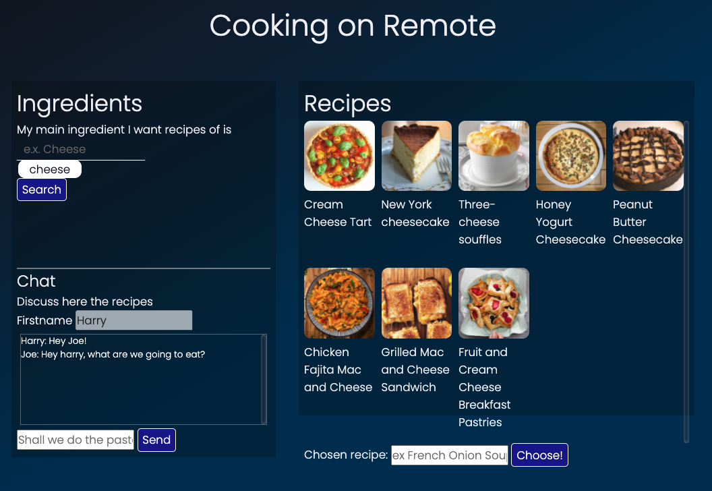
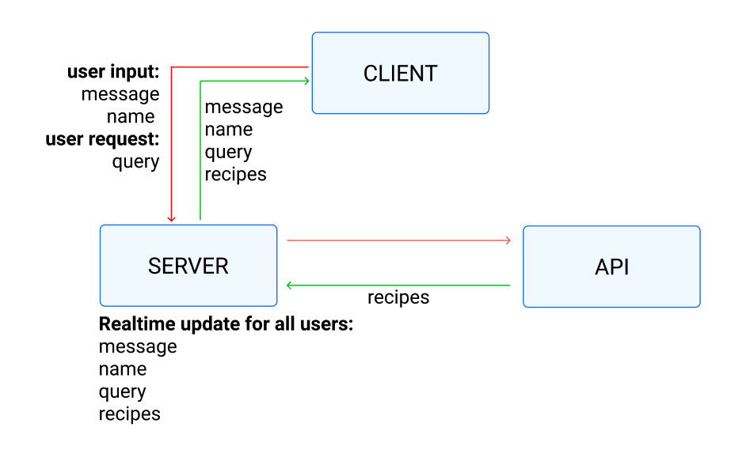

##### Real-Time Web-2021 @cmda-minor-web 2020 - 2021

  [](https://ralfz123.github.io/real-time-web-2021) [](shields.io)
# Recipe creator :fork_and_knife: :meat_on_bone:
_Real-Time Web, a course of the minor Web Design & Development. It is a minor of the third year from the study [CMD](https://www.cmd-amsterdam.nl/)._

[Link to live version :rocket:](https://rtw-2021.herokuapp.com/)

### Table of Contents
<table style="margin-left: auto; margin-right: auto;">
    <tr>
        <td align="center"><a href="#rocket-purpose">🚀 Purpose<a></td>
        <td align="center"><a href="#heart_eyes-concept">😍 Concept<a></td>
        <td align="center"><a href="#1234-data">🔢 Data<a></td>
        <td align="center"><a href="#nerd_face-techstuff">🤓 TechStuff<a></td>
        <td align="center"><a href="#nerd_face-codestyle">🤓 CodeStyle<a></td>
        <td align="center"><a href="#gear-installation">⚙️ Installation<a></td>
        <td align="center"><a href="#file_folder-sources">📁 Sources<a></td>
        <td align="center"><a href="#cop-license">👮 License<a></td>
    </tr> 
</table>

## :rocket: Purpose
During this course you will learn how to build a real-time application. You will learn techniques to setup an open connection between the client and the server. This will enable you to send data in real-time both ways, at the same time.

The course Real-Time Web is about learning how to build a real-time application. Real-Time Web is part of the half year minor programme about Web Design and Development in Amsterdam. Bachelor Communication and Multimedia Design, Amsterdam University of Applied Science.

## :heart_eyes: Concept
[_3 Concepts_](wiki.com)

>_This is the solution for cooking together in times of Corona :fork_and_knife:._

This application is an app where you can cook with each other on distance (each person from his/her own house). You start the application where you can both search on recipes by entering some food ingredients that you have in your house. When you both are agree with one recipe, you click on that recipe and you can start cooking. You both set a timer about how long you think it will take to cook the recipe. Also you follow the instructions of the recipe and you can check them by the checkboxes. The person who finishes the dish first is the winner :trophy: .


### Sketches

<figure>
     
    <figcaption>First sketch</figcaption>
</figure>


<figure>
     
    <figcaption>First live app (v1)</figcaption>
</figure>

### Spike
#### Timer and Instructions challenge 
- Is this a good challenge
- Have to pick the timer or the instructions or combine both?

### Improvements
Ik heb data gerenderd van de recepten clientside, zodat server niet wordt overloaded door de serverside rendering

#### Features
**Login**  
- Authenticated login with username and password
- Create rooms of 2 persons

**App**  
- You can search through recipes by entering a ingredient
- You can chat with each other to talk about which recipe you pick
- You can see the details of the recipe, when it's chosen
- You can set a timer and follow the instructions of the recipe both on the same time (real-time :wink: )
- Hover over recipe, get data in tooltip

## :nerd_face: TechStuff
This app is built, using:
- [Socket.io](http://socket.io/)
- [npm](https://www.npmjs.com/)
- [Node.js server](https://nodejs.org/)
- [Express router](https://expressjs.com/)
- [EJS Templating engine](https://ejs.co/)
- [Heroku deployment](https://www.heroku.com/nodejs)

## :lipstick: CodeStyle
I prefer to work with these dev-rules for myself:
- Use of semicolon at the end of the line
- Spaces: 2
- Code comments
    - param explanation of functions
    - inline code comments after variable declaration
- naming of variables and functions has to be descriptive
- ES6 modules

# :1234: Data
### API is
<!-- 1. (x) [spoonacular](https://spoonacular.com/food-api/docs#Analyze-Recipe) -->
[mealDB](https://www.themealdb.com/api.php)

### :key: KEY
You can get the data by entering a query after the url.
Developer test `API-KEY` = `1`.
[Here](https://www.themealdb.com/api.php) is a list of how you handle the URL of the API.

<!-- Search meal by name
www.themealdb.com/api/json/v1/1/search.php?s=Arrabiata
List all meals by first letter
www.themealdb.com/api/json/v1/1/search.php?f=a
Lookup full meal details by id
www.themealdb.com/api/json/v1/1/lookup.php?i=52772
Lookup a single random meal
www.themealdb.com/api/json/v1/1/random.php -->


### Data variables
The data variables I used, are:
- `idMeal`
- `strMeal`
- `strCategory`
- `ingredients` - Array
- `strInstructions`
- `strMealThumb`
- `strYoutube`

### Dataset structure
#### RAW

```js
{
    meals: [
            {
                idMeal: "52779",
                strMeal: "Cream Cheese Tart",
                strDrinkAlternate: null,
                strCategory: "Starter",
                strArea: "Unknown",
                strInstructions: "Crust: make a dough from 250g flour (I like mixing different flours like plain and wholegrain spelt flour), 125g butter, 1 egg and a pinch of salt",
                strMealThumb: "https://www.themealdb.com/images/media/meals/wurrux1468416624.jpg",
                strTags: "Tart,Savory",
                strYoutube: "https://www.youtube.com/watch?v=UhQPwO4uymo",
                strIngredient1: "Flour",
                strIngredient2: "Butter",
                strIngredient3: "Egg",
                strIngredient4: "Salt",
                strMeasure1: "250g",
                strMeasure2: "125g",
                strMeasure3: "1",
                strMeasure4: "Pinch",
                strSource: "https://www.instagram.com/p/BHyuMZ1hZX0",
                strImageSource: null,
                strCreativeCommonsConfirmed: null,
                dateModified: null
            },
        ]
}
```

#### CLEAN

```js
{
    meals: [
            {
                idMeal: "52779",
                strMeal: "Cream Cheese Tart",
                strCategory: "Starter",
                strInstructions: "Crust: make a dough from 250g flour (I like mixing different flours like plain and wholegrain spelt flour), 125g butter, 1 egg and a pinch of salt",
                strIngredient1: "Flour",
                strIngredient2: "Butter",
                strIngredient3: "Egg",
                strIngredient4: "Salt",
                strYoutube: "https://www.youtube.com/watch?v=UhQPwO4uymo",
                strMealThumb: "https://www.themealdb.com/images/media/meals/wurrux1468416624.jpg",
            },
           ]
}
```


### Data lifecycle diagram


Have to be done:  
- Login data
- Rooms (has to work always, except the amount of online users)


## Challenges / Inventions:
Learned:  
- websocket using socket.io

## :gear: Installation
1. Clone the repository:  
```
git clone https://github.com/ralfz123/real-time-web-2021.git
```

2. Install dependencies   
```
npm install
```

3. To run the app   
```
npm run start
```

4. To run the app in developer mode (with nodemon)
```
npm run dev
```
5. Go to [localhost](http://localhost:5000/) in the browser and voilà :sparkles:
```
http://localhost:5000/
```

## To-Do's :pencil:
<details>
<summary>Expand</summary>

#### App:

- [ ] Create login
    - [ ] Sign in as name and send messages
- [ ] Create room
- [x] Put words as queries for the recipes
- [ ] Authentication (DB / login with name)
- [ ] Handle incorrect queries
    - [ ] Display under the input field, not in recipes box

#### Code:
- [x] Render data from querie data
- [ ] Clear preview from new query data rendering
- [ ] Search query through data.meals[i].strIngredient (==)
- [ ] Getting alert when teamplayer has started the match, but you are yet on /home
- [ ] Filter ingredients in one way instead of mentioning each ingr
- [ ] Filter instructions in sentences

- [ ] rename functions and variables to descriptive ones


#### Readme:
- [x] Data lifecycle diagram
- [ ] 3 concepts describe in wiki
    - sketch
    - api
    - why
    - concept

#### Backlog
- [ ] Multiple ingredients as query
- [ ] Diet meals
- [ ] allergic meals
- [ ] When on /match, play Audio for each (io.emit)


</details>

## :file_folder: Sources
Credits to [Justus](https://github.com/ju5tu5) && [Koop Reynders](https://github.com/KoopReynders) && for giving interesting lectures about Real Time Webapps and how to deal with it.

### Code sources
- Stackoverflow (n.d.). Searching for answers on dev questions - Stackoverflow. Retrieved 6 April 2021 from https://www.stackoverflow.com

- npm (n.d.). Package manager with many packages - npm. Retrieved 6 April 2021 from https://www.npmjs.com

- Node.js (n.d.). A Runtime engine server for Chrome V8 - Node.js. Retrieved 6 April 2021 from https://nodejs.org

- Express (n.d.). Framework for Node.js - Express. Retrieved 6 April 2021 from https://expressjs.com/

## :cop: License
[](https://opensource.org/licenses/MIT)  
This project from [Ralf](https://github.com/ralfz123) has a [MIT © License](https://github.com/ralfz123/real-time-web-2021/blob/main/LICENSE)
